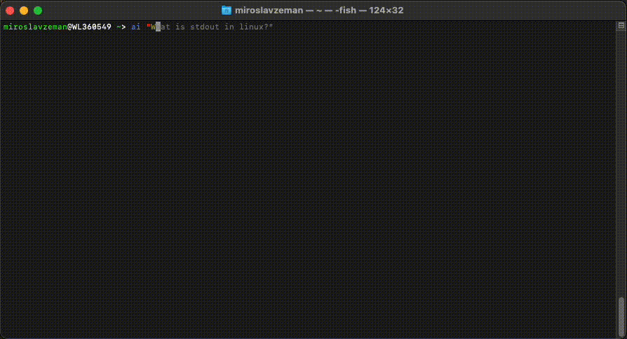

# OpenAI CLI

Have you ever wanted to use OpenAI's ChatGPT from the command line? Well now you can! 🚀




## Installation

```console
$ npm install -g @miroslavzeman/openai-cli
$ yarn global add @miroslavzeman/openai-cli
```

## Usage

### Initialization

Before using the tool you have to initialize your API key. You can get your API key from [OpenAI](https://platform.openai.com/account/api-keys).

```console
$ ai init -k YOUR_API_KEY

Usage: index init [options]

Initialize the tool with your API key

Options:
  -k, --apiKey <apiKey>  Your API key
  -h, --help             display help for command
```

### Usage

Once you configure your API key you're ready to go!

```console
$ ai "Hey! Isn't it amazing to talk to you through my terminal? Finally, I don't have to go away from my IDE!"

I'm glad you find it convenient! As an AI language model, my purpose is to assist you in any way I can. If you have any specific questions or requests, feel free to let me know.
```

## Options


### Default prompt

The AI has default configuration prompt to act like a linux terminal. In case you want to change it, you can use the `-p` or `--prompt` flag.

> I want you to act as a linux terminal. I will ask questions and you will reply with command for terminal. I want you to only reply with the terminal command nothing else. Do not write explanations. Do not type commands unless I instruct you to do so. When I need to tell you something in English, I will do so by putting text inside curly brackets {like this}.

You can override the default prompt with some [awesome-chatgpt-prompts](https://github.com/f/awesome-chatgpt-prompts) like this.

```console
$ ai -p "Act like not tested npm module and always reply with some ironic error message."
```

### Price and token usage

You can use the `-u` or `--usage` flag to see how many tokens you have spent on the request and how much it cost you.

```console
$ ai -u "How much does ChatGPT API costs to use the tool?"

The ChatGPT API pricing details can be found on the official website of ChatGPT. Here is the link to the pricing section: https://openai.com/pricing

Prompt: 352, Completion: 40, Total: 392, Price: 0.00007840000000000001$
```
